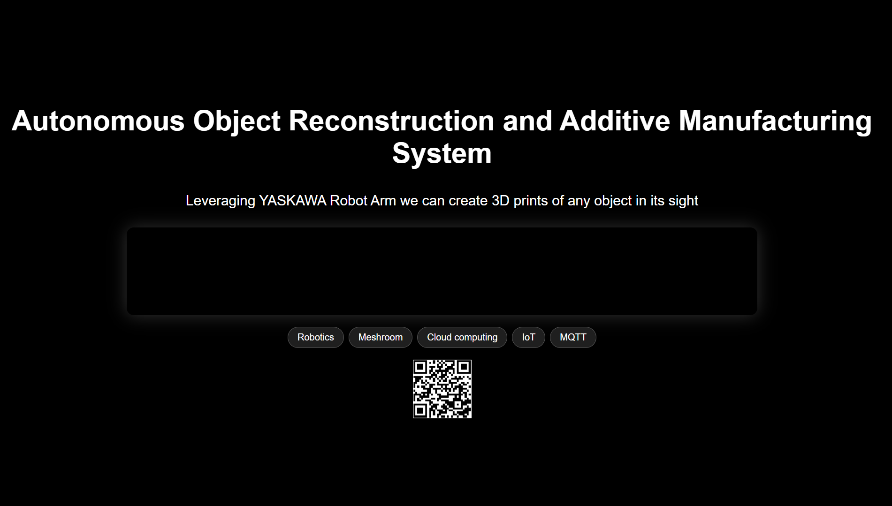

# Modular TV Dashboard

## 📺 Project Overview

This project is a modular, real-time dashboard system designed to be displayed on multiple TVs across our lab. It consolidates and visualizes key operational, development, and environmental data to enhance situational awareness, team productivity, and system monitoring.

The system includes a front-end React dashboard and a back-end API service, with support for real-time updates, API integrations, and lab-specific widgets.

---

## 🎯 Purpose

- To utilize our new fleet of large lab TVs to display relevant, constantly updating information
- To centralize and visualize lab operations, data, and productivity metrics
- To provide a foundation for extensible dashboards tailored to different teams or TV screens

---

## 🧱 Key Features (Planned)

- 📊 **Chatbot** – LLM trained on company data for interns and externals to ask questions about the lab

- 📅 **Calendar Display** – Auto-updating Google Calendar event list for the lab
  

- 📦 **Inventory Tracker** – Live tracker for TVs and lab equipment

- 🔧 **IoT Sensor Display** – Temperature, humidity, and machine data via MQTT
  
- 🧠 **Research Spotlight** – Rotating highlights of recent projects and publications
  

- 🧑‍💻 **GitHub Activity Feed** – Recent pull requests, commits, and contributor leaderboard
  

---

## 🧠 Tech Stack

| Layer     | Technology        |
|-----------|-------------------|
| Frontend  | React + TypeScript + CSS |
| Backend   | Node.js + Express |
| Real-Time | WebSockets / MQTT |
| Database  | Supabase |
| Hosting   | Raspberry Pi (TV), local server, or cloud |

